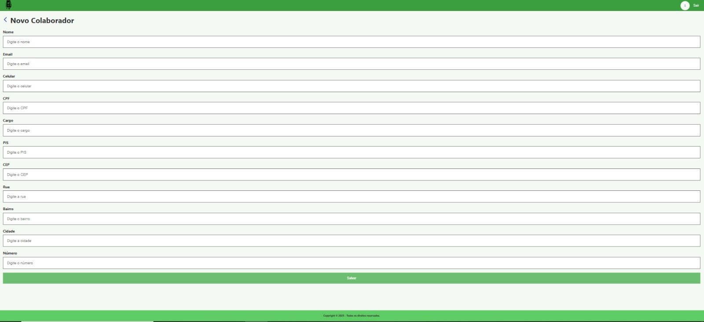
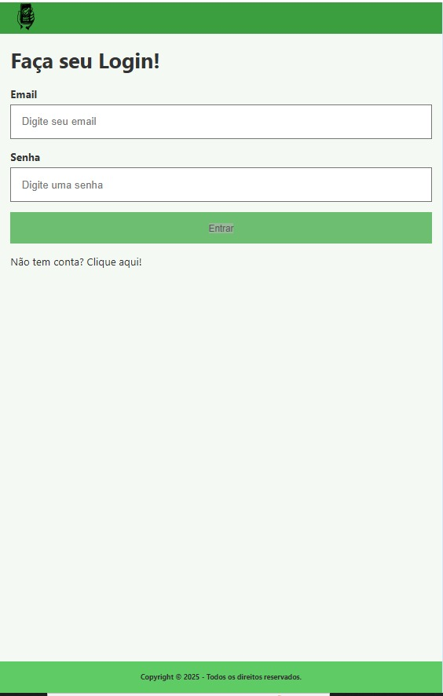

# EASY CHECK

### Repositórios

## [Front-end](https://github.com/easycheck-team/easycheck-frontend.git)
## [Back-end](https://github.com/easycheck-team/easycheck-backend.git)

### Integrantes

### [Ana Bezerra](https://github.com/anavbezerra)
### [André Arantes](https://github.com/arantesandre)
### [André Guimarães](https://github.com/GuimaFox)
### [Leandro Lemes](https://github.com/LeandrojLemes)
### [Léo Jaime](https://github.com/LeoJaime-92)

## Descrição

Quanto vale o seu tempo? E quanto vale a segurança dos seus funcionários?

Com o Easy Check, facilitamos o seu trabalho. Você não vai mais perder horas analisando documentação e nem correr o risco de ter funcionários inaptos trabalhando. Nosso aplicativo utiliza a tecnologia de QR code para simplificar todo o processo de verificação de documentos.

Cada funcionário possui um crachá com um QR code único. Ao escanear esse código com o Easy Check, o aplicativo verifica instantaneamente se todos os documentos necessários estão atualizados e em conformidade com as normas de segurança. Em questão de segundos, você sabe se o funcionário está apto para ingressar na obra ou se precisa atualizar algum documento.

Isso significa uma economia significativa de tempo e uma garantia de que apenas funcionários com a documentação correta estarão trabalhando. Com o Easy Check, você pode focar no que realmente importa: a segurança e a eficiência da sua obra.

Experimente o Easy Check e veja a diferença que ele pode fazer no seu dia a dia. Ganhando tempo e garantindo a segurança da sua equipe, você estará investindo no sucesso do seu projeto.

### Requisitos Funcionais

André Arantes
RF01: O sistema deve permitir que a empresa se cadastre na plataforma.

Leandro Lemes
RF02: O sistema deve permitir que o usuário cadastre cargos e vagas.

Ana Maria
RF03: O sistema deve permitir que o usuário cadastre dados pessoais do colaborador.

Leo Jaime
RF04: O sistema deve permitir que o usuário cadastre dados profissionais do colaborador.

André Guimarães
RF05: O sistema deve permitir que o usuário cadastre documentos com validade.

### Protótipo de telas

### Cadastro de colaboradores

### Login

